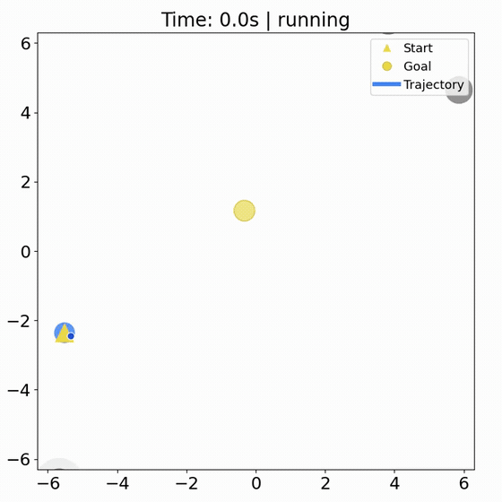

# DiffCVaR: Reinforcement Learning Adaptive CVaR Barrier Function

## Demo



## Getting Started

For macOS (CPU):

```bash
conda env create -f environment.yml
conda activate diff_cvar_jax
python -m pip install "jax==0.6.2" "optax==0.2.8"
```

## Quick Start

```bash
WANDB_MODE=disabled RUN_NAME=diff_cvar_gnn bash scripts/run_ppo.sh
```

Select one of the other three models:

```bash
WANDB_MODE=disabled RUN_NAME=diff_cvar_mlp bash scripts/run_ppo.sh model=diff_cvar_mlp
WANDB_MODE=disabled RUN_NAME=ppo_gnn bash scripts/run_ppo.sh model=ppo_gnn
WANDB_MODE=disabled RUN_NAME=ppo_mlp bash scripts/run_ppo.sh model=ppo_mlp
```

Both `unicycle` (default) and `single_integrator` are supported. For example:

```bash
WANDB_MODE=disabled RUN_NAME=diff_cvar_mlp_si bash scripts/run_ppo.sh model=diff_cvar_mlp robot=single_integrator
```

Outputs are written under `outputs/crowd_dyn_var_num_env/runs/<run_name>-<model>-bs<batch>-ep<epochs>-lr<lr>/`. Each run saves its resolved `config.yaml` and, after evaluation, checkpoints.  

## Common Overrides

Options can be passed directly to the shell launcher:


| Option           | Default         | Override example                  |
| ---------------- | --------------- | --------------------------------- |
| Model            | `diff_cvar_gnn` | `model=ppo_mlp`                   |
| Device           | `auto`          | `device=cpu` or `device=cuda`     |
| Environments     | `128`           | `trainer.num_envs=64`             |
| Timesteps        | `20000000`      | `trainer.total_timesteps=5000000` |
| Number of humans | `20`            | `env.humans.num_humans=15`        |


Example:

```bash
RUN_NAME=ablation bash scripts/run_ppo.sh env.humans.num_humans=25
```

For all parameters, see the YAML files under `config/`.

## W&B Logging

Online logging:

```bash
wandb login
WANDB_PROJECT=<project_name> WANDB_ENTITY=<user_or_team> \
  RUN_NAME=online_run bash scripts/run_ppo.sh
```

Use `WANDB_MODE=disabled` to disable W&B entirely.

## Evaluation

List available runs and checkpoints:

```bash
ls outputs/crowd_dyn_var_num_env/runs
ls outputs/crowd_dyn_var_num_env/runs/<run>/ckpt_*.pkl
```

Evaluate one checkpoint with deterministic base seeds:

```bash
RUN_DIR=outputs/crowd_dyn_var_num_env/runs/<run>

python scripts/eval.py \
  --save-dir "$RUN_DIR" \
  --checkpoint "$RUN_DIR/ckpt_<step>.pkl" \
  --seeds 100,200,300 \
  --episodes 1
```

Results are saved to `$RUN_DIR/eval_results.json`. Each `(base seed, episode index)` has an independent reset and dynamics RNG stream.

Save rollout videos:

```bash
python scripts/eval.py \
  --save-dir "$RUN_DIR" \
  --checkpoint "$RUN_DIR/ckpt_<step>.pkl" \
  --seeds 100 \
  --episodes 1 \
  --visualize
```

Videos are saved under:

```text
<run>/visualize_ckpt_<step>/seed_<base_seed>_episode_<index>_<status>.mp4
```


## Acknowledgments

The PPO update follows [Brax](https://github.com/google/brax). The differentiable QP implementation is based on the ideas in [locuslab/qpth](https://github.com/locuslab/qpth). This project also relies on [JAX](https://github.com/jax-ml/jax) and [Optax](https://github.com/google-deepmind/optax).

## Project Structure

```text
config/           Hydra environment, four model, robot, and PPO defaults
env/              Fixed-ID JAX SocialNav state and dynamics
model/            GNN/MLP DiffCVaR-CBF-QP and PPO policies
solver/jax_qpth/  Batched differentiable QP solver
trainer/          PPO rollout, update, evaluation, and checkpoints
scripts/          Training and evaluation entrypoints
```

## Citation

If you find this work useful, please cite:

```bibtex
@article{wang2026diffcvar,
  title={DiffCVaR: Reinforcement Learning for Risk Adaptation via Differentiable CVaR Barrier Functions},
  author={Wang, Xinyi and Kim, Taekyung and Hoxha, Bardh and Fainekos, Georgios and Panagou, Dimitra},
  journal={IEEE Robotics and Automation Letters},
  year={2026},
  url={https://arxiv.org/abs/2605.21257}
}
```
